<!-- Animated Wave Header -->

<!-- Typing animation -->

 

<!-- Social Badges -->

---

## 👤 About Me

> *"Every dataset is a story waiting to be told — and I'm here to translate the numbers into narrative."*

Saya **Adam Suvi, S.Si., C.DA** — seorang **Data Analyst** dan lulusan **Matematika** dari **Universitas Andalas**, Padang. Saya bersertifikasi resmi **BNSP Certified Data Analyst (C.DA)** dari Syntaxnesia Training Centre, serta menyelesaikan sertifikasi professional dari **Google** dan **Meta** di bidang Data Analytics.

### 🎯 What I Do

- 📊 **Data Analysis & Visualization** — Mengolah raw data menjadi insight yang actionable menggunakan SQL, Python, dan BI tools
- 🤖 **AI/ML Engineering** — Membangun model prediktif dan neural network (ANN, TensorFlow)
- 🌐 **Web Development** — Full-stack web applications dengan Next.js, React, dan modern frameworks
- ⚙️ **Automation** — Bot dan workflow automation untuk meningkatkan produktivitas

### 📋 Quick Facts

| | |
|---|---|
| 🎓 **Education** | S.Si. — Bachelor of Mathematics, Universitas Andalas |
| 📜 **Certification** | C.DA — BNSP Certified Data Analyst |
| 📍 **Location** | Padang, Indonesia |
| 💼 **Focus** | Data Analytics · Business Intelligence · AI/ML |
| 🌐 **Portfolio** | [adamsportofolio.netlify.app](https://adamsportofolio.netlify.app) |

 

---

## 🛠️ Tech Stack & Skills

### 📊 Data Analysis & Visualization

### 💻 Web & Automation

### ☁️ AI & Cloud

---

## 🚀 Featured Projects

| Project | Description | Tools | Link |
|---------|-------------|-------|------|
| 📊 **Superstore Customer Analyst** ⭐ | Customer segmentation, trend analysis, BI dashboard | SQL · Python · Power BI · Excel · R |  |
| 🏙️ **DKI Jakarta Sales Report** | Regional sales 2023–2025, KPI visualization | Power BI · Power Query · Pivot Table |  |
| 🛒 **Surya Mart Project** | Retail data analysis, customer behavior | Python · Pandas · Excel · SQL |  |
| 🔮 **Ethereum Price Prediction** | ANN model for crypto trend prediction | Python · TensorFlow · ANN |  |
| 🌐 **Portfolio Website** | 3D background, bilingual, Framer Motion | Next.js · Three.js · Tailwind CSS |  |
| 🤖 **Job Tracker WA Bot** | Auto-log job applications via WhatsApp | Node.js · Gemini AI · Sheets API |  |

📂 <b>View All Project Files →</b>

 

Kunjungi repository **[adam-projects](https://github.com/adamsuvi7/adam-projects)** untuk akses lengkap ke semua file project PDF, presentasi, dan dokumentasi.

---

## 🏆 Certifications

| Certificate | Issuer | PDF |
|-------------|--------|-----|
| 🥇 **BNSP Certified Data Analyst (C.DA)** | Syntaxnesia Training Centre |  |
| 📗 **Google Data Analytics Professional** | Coursera / Google |  |
| 📘 **Meta Data Analyst Professional** | Coursera / Meta |  |
| 💻 **Bootcamp Data Analyst Batch 2** | Harisenin.com |  |

📁 **[View All Certificates →](https://github.com/adamsuvi7/certificates)**

---

🏢 <b>Organizations & Leadership</b>

 

### 🏛️ BEM FMIPA Universitas Andalas
**PLT Gubernur & Head of Kastrat**
> Led 80+ members · 15+ initiatives · 40% participation increase

### 🎓 LKMMTD
**Head of Event**
> Directed 80+ committee, 400+ participant leadership training

### 📚 HIMATIKA UNAND
**PSDM Coordinator**
> Soft skill development & mentoring for 60+ new members

🏅 <b>Achievements</b>

 

### 🥈 1st Runner-Up — Duta Genre Kota Bukittinggi
> Represented youth in education & advocacy · 10+ public talks · 500+ participants

---

## 📊 GitHub Stats & Activity

<!-- GitHub Stats Card -->

<!-- Streak Stats -->

<!-- Activity Graph -->

---

<!-- Snake Animation -->

### 🐍 Watch the snake eat my contributions!

<picture>
  <source media="(prefers-color-scheme: dark)" srcset="https://raw.githubusercontent.com/adamsuvi7/adamsuvi7/output/github-contribution-grid-snake-dark.svg" />
  <source media="(prefers-color-scheme: light)" srcset="https://raw.githubusercontent.com/adamsuvi7/adamsuvi7/output/github-contribution-grid-snake.svg" />
  
</picture>

---

<!-- Interactive Section -->

### 💬 Let's Connect & Interact!

<!-- Ask Me Anything -->

<!-- Random Dev Quote -->

  

<!-- Dynamic Stats Badges -->

---

### 🌟 Support My Work

⭐ **If you find my projects useful, please consider starring the repos!**

 

  

📬 **adamsuvi7@gmail.com** | [LinkedIn](https://linkedin.com/in/adam-suvi7) | [Portfolio](https://adamsportofolio.netlify.app) | [Certificates](https://github.com/adamsuvi7/certificates)

<!-- Animated Wave Footer -->

